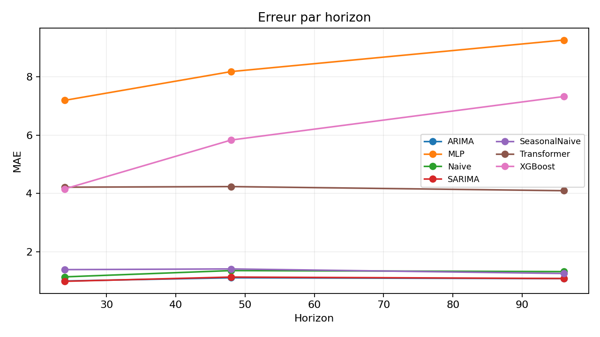
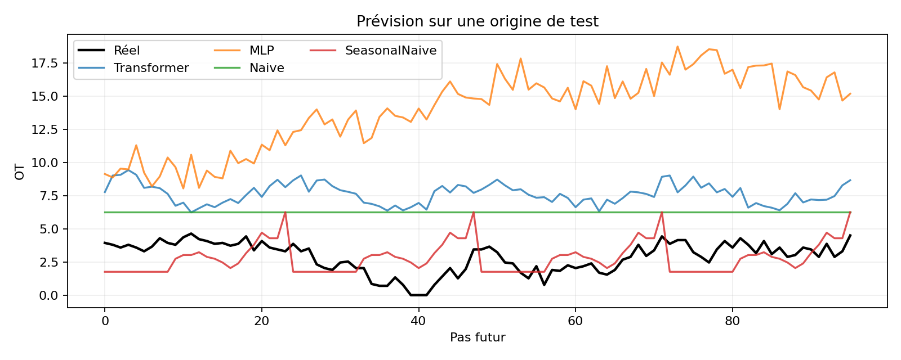
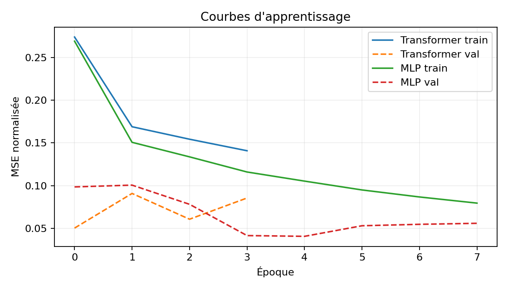

# nano-forecaster

## Objectif et hypothèse

Ce banc d'essai mesure si une petite attention causale apporte un gain face à des
méthodes classiques pour prévoir `OT` dans ETTh1. L'objectif est méthodologique,
pas une revendication d'état de l'art.

## Données et protocole

ETTh1 contient 17420 observations horaires. Le split temporel est
strict, avec frontières aux indices 12194 et
13935. Le normaliseur est ajusté sur le train uniquement.
Le run rapporté utilise 8192 fenêtres train,
128 validation et 128 test,
avec la seed 42 et la configuration `configs/long.yaml`.

## Architecture

```text
features -> projection -> position -> blocs causaux -> dernier token -> H sorties
                                  | attention multi-têtes + FFN |
```

L'attention, le masque causal, les résiduels, les normalisations et la tête directe
sont codés dans `src/model.py`, sans `nn.Transformer` ni modèle préfabriqué.
Le Transformer compte 159840 paramètres, le MLP
en compte 100640.

## Baselines

Le protocole compare dernier point, naïve saisonnière 24 h, ARIMA, SARIMA, MLP et
XGBoost sur les mêmes origines, cibles et horizons. XGBoost reçoit les retards
multivariés ainsi que l'heure, le jour de semaine et le mois en encodage cyclique.

## Résultats

| model | horizon | MAE | RMSE | MAPE | sMAPE |
| --- | --- | --- | --- | --- | --- |
| SARIMA | 24 | 0.9808 | 1.2486 | 46.1643 | 39.8982 |
| ARIMA | 24 | 0.9912 | 1.2543 | 46.1416 | 39.9865 |
| Naive | 24 | 1.1330 | 1.4406 | 52.9917 | 46.9395 |
| SeasonalNaive | 24 | 1.3815 | 1.6695 | 67.1171 | 55.3644 |
| XGBoost | 24 | 4.1532 | 4.5474 | 191.2434 | 85.0250 |
| Transformer | 24 | 4.2102 | 4.3797 | 191.6749 | 88.3118 |
| MLP | 24 | 7.1918 | 7.3837 | 308.6812 | 113.2427 |
| ARIMA | 48 | 1.1012 | 1.3356 | 47.7821 | 41.9891 |
| SARIMA | 48 | 1.1261 | 1.3732 | 49.4503 | 42.9918 |
| Naive | 48 | 1.3482 | 1.6743 | 59.6955 | 52.5483 |
| SeasonalNaive | 48 | 1.4051 | 1.6739 | 64.0825 | 55.3134 |
| Transformer | 48 | 4.2312 | 4.4105 | 187.8767 | 87.1374 |
| XGBoost | 48 | 5.8289 | 6.3043 | 250.4910 | 98.7790 |
| MLP | 48 | 8.1780 | 8.4575 | 344.8114 | 117.1652 |
| ARIMA | 96 | 1.0724 | 1.3285 | 38.4990 | 36.8905 |
| SARIMA | 96 | 1.0768 | 1.3425 | 39.2434 | 37.1363 |
| SeasonalNaive | 96 | 1.2484 | 1.5403 | 48.8360 | 46.8784 |
| Naive | 96 | 1.3138 | 1.6535 | 49.5611 | 48.3004 |
| Transformer | 96 | 4.0898 | 4.2660 | 163.4927 | 81.0755 |
| XGBoost | 96 | 7.3227 | 7.7094 | 272.8322 | 106.0843 |
| MLP | 96 | 9.2614 | 9.5597 | 346.3863 | 118.6603 |







## Analyse honnête

Meilleur MAE observé par horizon: H=24: SARIMA (MAE 0.9808); H=48: ARIMA (MAE 1.1012); H=96: ARIMA (MAE 1.0724).
Le Transformer ne gagne sur aucun horizon dans ce run. Détail: H=24: écart de 3.2294 MAE face au meilleur modèle; H=48: écart de 3.1301 MAE face au meilleur modèle; H=96: écart de 3.0174 MAE face au meilleur modèle.
Le temps mesuré d'entraînement du Transformer est
19.39 s sur `cpu`.
Ces chiffres décrivent ce run précis et ne sont pas extrapolés. MAPE exclut les
cibles exactement nulles, pour lesquelles cette métrique est indéfinie.

## Limites

Le run publié emploie la configuration rapide et un sous-ensemble déterministe
des fenêtres. ARIMA et SARIMA sont réajustés à chaque origine, ce qui est loyal
mais coûteux. Une seule seed et un seul dataset ne permettent pas d'estimer la
variance ni la généralisation inter-datasets. MAPE est instable près de zéro.

## Reproduire

```bash
python3.11 -m venv .venv
. .venv/bin/activate
pip install -r requirements.txt
bash scripts/run_all.sh configs/small.yaml
```

Le script télécharge ETTh1, lance les tests, entraîne tous les modèles, recalcule
les métriques, régénère les figures et réécrit ce README depuis les artefacts.
Pour l'expérience plus longue: `bash scripts/run_all.sh configs/default.yaml`.

## Licence

Apache License 2.0, voir `LICENSE`.
